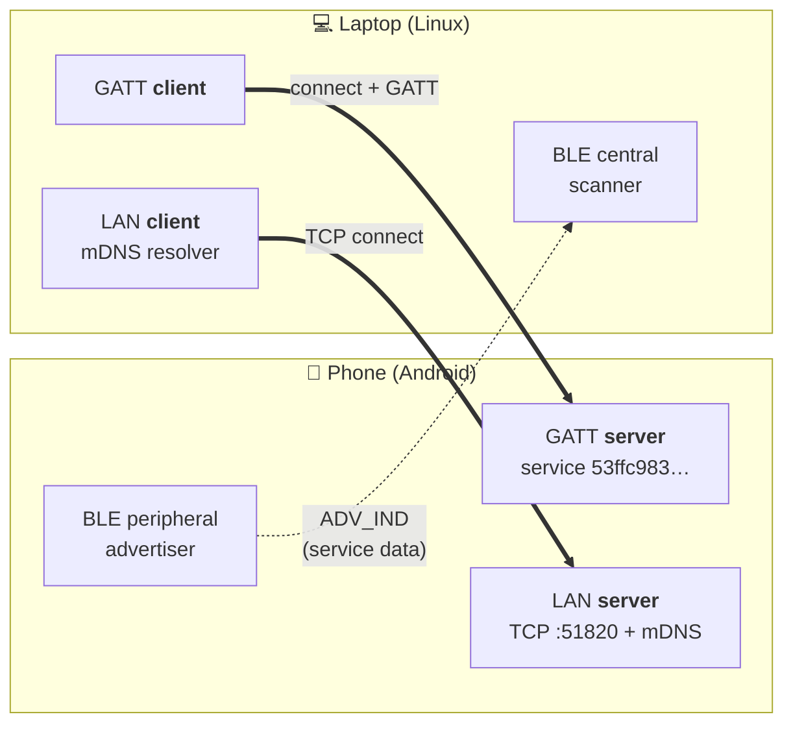
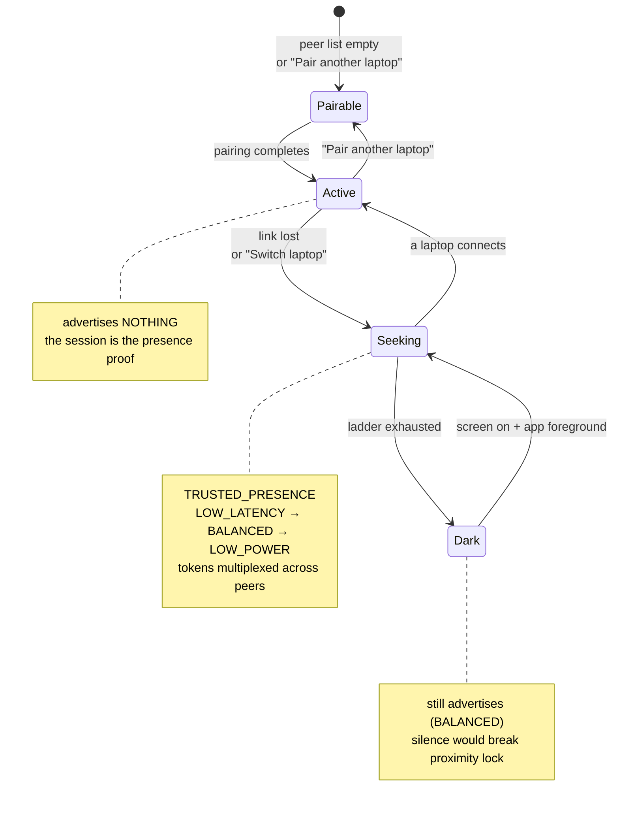
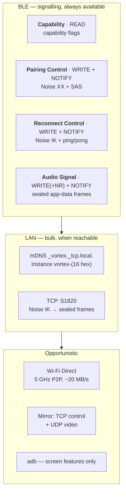
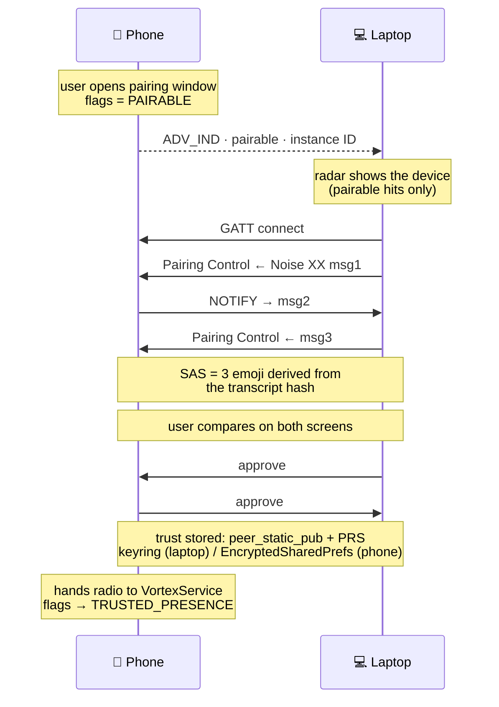
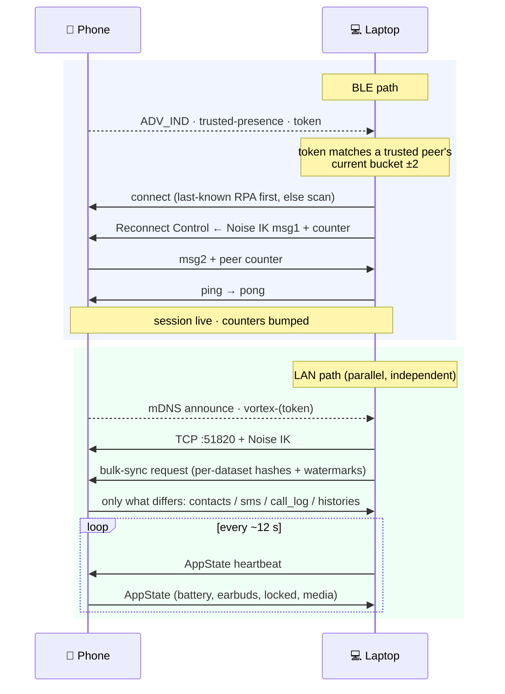
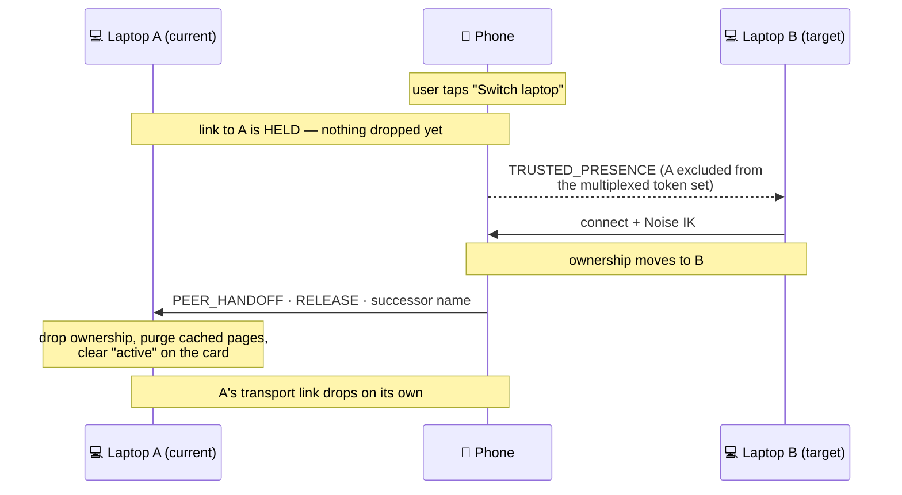

# Vortex communication scheme

How a phone and a laptop find each other, authenticate, and exchange data.
Reflects the code as of `feat/allow-multiple-peering`.

Everything here is peer-to-peer. There is no server, no relay, and no cloud
account anywhere in these paths.

---

## 1. Roles are fixed

The two devices are **not** symmetric, and several design decisions follow from
that. The phone advertises and serves; the laptop scans and connects.



The laptop never advertises and the phone never scans. So "make yourself
findable" is always the phone's job, which is why the whole multi-peer design
turns on *what the phone advertises* rather than on discovery symmetry.

---

## 2. Discovery — BLE advertisement

One legacy `ADV_IND`, already at the 31-byte ceiling: a 3-byte Flags AD plus a
28-byte Service Data AD (16-byte UUID + 10-byte payload). There is no room for
a second payload field.

```
Service Data (10 bytes)
┌────────┬────────┬──────────────────────────────┐
│ ver=01 │ flags  │      payload_8 (8 bytes)     │
└────────┴────────┴──────────────────────────────┘
             │                    │
   bit0 PAIRABLE ──────────► random pairing-window instance ID
   bit1 TRUSTED_PRESENCE ──► rotating presence token
```

`is_well_formed()` requires reserved bits 2–7 zero and **exactly one** of
bit0/bit1 — mirrored in Rust and Kotlin. A third mode bit would be rejected as
malformed by every deployed peer, which is why "seeking" is a local power state
and not a wire flag.

The presence token is per-peer, rotating hourly-ish by 60 s buckets:

```
token = HMAC-SHA256(peer.prs, "vortex/v1/presence" ‖ u64_be(bucket))[0..8]
bucket = unix_seconds / 60
```

The laptop accepts the current bucket **±2** (clock skew, Doze-deferred
rotations). The token is a privacy / anti-DoS filter, **not** authentication —
Noise IK still gates trust. The same construction names the mDNS instance, so
one mechanism covers both transports.

### Phone advertising states



Two constraints shape this:

- **`Active` = silent** is the main battery win, and it is safe because the
  laptop's proximity auto-lock treats *session OR advertisement* as presence.
  Measured resume after a real disconnect: **16 ms** to back on air, against a
  25 s away-grace and a 2 s confirmation scan.
- **`Dark` still advertises.** Going fully silent would make a present-but-idle
  phone look absent to that same confirmation scan, and would break walk-up
  reconnect.

With several remembered laptops the single advertising set **time-multiplexes**
tokens (~1.5 s dwell each), because one advertisement cannot address N peers.
With one peer it does not cycle at all — restarting the advertiser churns the
RPA for nothing.

---

## 3. Channels



Despite the name, **Audio Signal is the general sealed app-data channel** — it
carries notifications, clipboard, SMS, call log, notes, file offers and the
handoff frames, not just audio. The name is historical.

### Frame format

```
┌───┬─────┬────────────┬─────────────────────┐
│ty │ sub │ len u16 BE │ payload (≤ 63 KiB)  │
└───┴─────┴────────────┴─────────────────────┘
  0    1        2                4
```

Everything after the handshake is AEAD-sealed with the Noise transport ciphers.
Frame types are a flat `u8` registry mirrored byte-for-byte between
`core/ble/frame.rs` and `Frame.kt`; drift there is a protocol break, so both
files carry that warning.

| Range | Purpose |
|---|---|
| `0x10–0x12` | pairing handshake / approval |
| `0x20–0x21` | reconnect handshake |
| `0x30–0x3F` | keepalive, app-state, notifications, icons, calls, contacts, SMS, call log, bulk-sync |
| `0x40–0x4F` | clipboard, Wi-Fi Direct, file push, browsing handoff, notes, FRAG, **peer handoff** |
| `0x7F` | error |

Unknown frame types are **logged and ignored** on both sides. That is what makes
new types additive: an older peer is unaffected, so no version gate is needed.

`FRAG` (`0x4E`) exists because Android silently truncates a notify longer than
`ATT_MTU−3`. The sender splits the *already-sealed* frame into fragments; the
inner frame keeps one nonce for the whole logical frame.

> **Note on `shared/proto/vortex.proto`:** it describes the protocol at spec
> level, but the live BLE/LAN transport does **not** use `VortexMessage`. It
> uses the `Frame` format above. When adding a message, the frame registry is
> the thing that changes behaviour.

---

## 4. Pairing (first contact)



The SAS comparison is the MITM defence, and it happens **before** any BT-level
bond. Vortex deliberately creates **no BT bond on Linux** — LE bonding was
investigated and abandoned (BlueZ routes bonds over BR/EDR on dual-mode phones,
Just Works fails, no IRK). Reconnect is bondless: learn-latest-RPA plus a
presence scan.

A stale one-sided bond — one side holding a bond the other dropped — makes the
link tear down during encryption, so `ServicesResolved` never arrives and
pairing fails with `timeout: service discovery`. Forget now clears the bond on
both sides for exactly this reason.

---

## 5. Reconnect and steady state



Both transports run **independently and concurrently**. BLE gives fast
signalling that works with no network at all; LAN gives throughput. Either
alone is a working link, which is why the phone can read "connected" over BLE
on a Wi-Fi network with AP isolation where the LAN heartbeat never completes.

A cross-transport hint links them: the LAN heartbeat's down→up edge nudges the
BLE loop to retry its direct connect immediately instead of waiting out a scan
backoff.

Bulk-sync is diff-based — the laptop sends what it already has, the phone sends
only the delta, and each dataset reports `match` / `sent` / `error`
independently so one failing dataset cannot kill the connection.

---

## 6. Session ownership — one active peer

A device may **trust** many peers but is **active** with exactly one. Those are
deliberately separate: several transport links may briefly overlap during a
handoff, but only one peer owns the mirrored state (notifications, clipboard,
SMS pages, media). Without the split, connecting to a replacement before the old
link finished dropping would give two devices ownership at once.



**Seek before release** is the key property: the current link is held until a
replacement is confirmed. So a cancelled or fruitless switch leaves the device
exactly where it was, and there is no window in which it is connected to
nothing — which also means no suppression window is needed to stop the old
peer's reconnect loop racing back.

`PEER_HANDOFF` (`0x4F`) kinds: `RELEASE` (0x01), `BUSY` (0x02), `CLAIM` (0x03).
`BUSY` exists so a refused peer can back off — silence is indistinguishable from
packet loss and invites a retry loop against the phone's single GATT link.

The mirror direction is identical: when the laptop switches phones, it sends
`RELEASE` to the phone it displaced.

**Current limitation:** `RELEASE` rides the BLE sealed channel only. A switch
that happens with only a LAN session up will not deliver it, and the peer falls
back to noticing on next contact.

---

## 7. Opportunistic transports

**Wi-Fi Direct** — for bulk file transfer the phone creates a 5 GHz P2P group
and the laptop joins it via `nmcli`, pulls at ~20 MB/s, then restores its normal
Wi-Fi. Single adapter, so the laptop is briefly offline; the heartbeat targets
the group-owner IP while active.

**Screen mirroring** splits control from data: TCP carries control, **UDP
carries video**. TCP head-of-line blocking plus retransmit is exactly the
freeze-then-jump artefact to avoid. Security is kept without Noise's strict
in-order nonce by deriving a media key from the IK handshake hash and sealing
each datagram with ChaCha20-Poly1305 under an explicit per-packet counter,
guarded by a sliding replay window.

**adb** is used only for the screen features (Universal Control, second screen),
because writing to `/dev/uinput` requires the shell user. It carries no Vortex
protocol traffic.

---

## 8. Per-peer state

Secrets are keyed by `peer_static_pub` on both sides — PRS, reconnect counters,
audio nonces, the peer's BT address.

Cached phone data on the laptop is namespaced by public key, not by name (a
peer-supplied display name is untrusted, collides, and changes):

```
~/.cache/vortex/peers/<hex(peer_static_pub)[0..16]>/{sms,contacts,call_log,…}.json
```

Deliberately **global**, because they are one shared list by design:
`notes.json` and clipboard history.

---

## 9. Security properties in one place

| Property | Mechanism |
|---|---|
| MITM defence at pairing | Noise XX + 3-emoji SAS compared by the user |
| Reconnect authentication | Noise IK, PRS as prologue |
| Replay / rollback detection | monotonic per-peer counters exchanged in IK |
| Confidentiality of app data | AEAD-sealed frames on the Noise transport |
| Advertisement unlinkability | 8-byte token rotating per 60 s bucket, per peer |
| Revocation | forgetting deletes the PRS, so its token can no longer be derived |
| Video data plane | media key from the IK hash, per-packet counter + replay window |

Per-peer tokens (rather than one shared device key) are what make revocation
clean: a forgotten peer's token is not merely rejected, it becomes
uncomputable, so that device is exactly as able to find the phone as a
stranger's — not at all.
