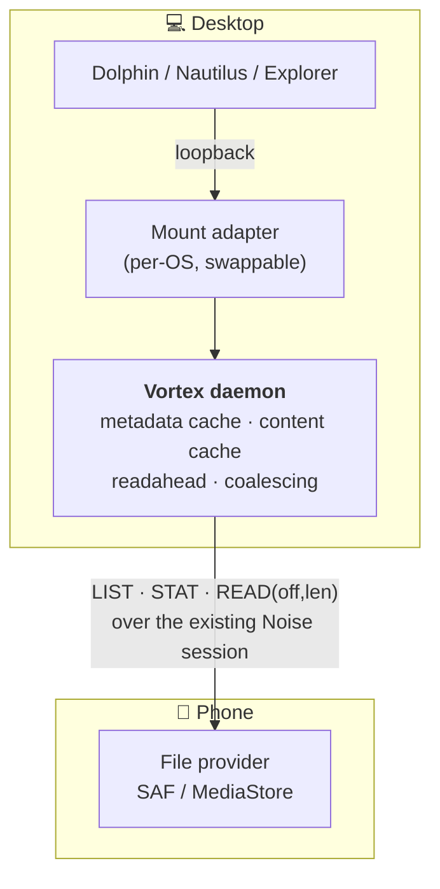

# Browsing the phone's files from the desktop

**Status:** design, not implemented. **Targets:** Linux *and* Windows from day
one — the Windows port branch means every new feature needs both.

Goal: open the phone's storage in Dolphin / Nautilus / Explorer, like KDE
Connect does. Read-only first, writes stubbed.

---

## 1. Why this is the same work as fixing large-file transfer

There is exactly one missing primitive underneath both features:

```
READ(handle, offset, len) -> bytes
```

- **Browsing** needs it because file managers issue ranged reads constantly —
  Explorer's redirector does, thumbnailers do, media players seek.
- **Large-file transfer** needs it because the current design buffers whole
  files, which is what crashed the app on an 835 MB share (`OutOfMemoryError`,
  876 MB against a 256 MB heap growth limit).

Today there is **no offset-based read anywhere** in the codebase, and the
Android app declares **no storage permissions at all** — file access is only
ever a `content://` URI handed over by the share sheet. So both features start
from the same standing start, and the 64 MB `MAX_FILE_BYTES` cap disappears as a
side effect of building the primitive rather than as a separate change.

**Corollary:** do not raise `MAX_FILE_BYTES` in the meantime. It is bounded by
the process heap, so a bigger constant only moves the crash.

---

## 2. Layering

The load-bearing decision: **the phone serves a dumb, narrow protocol; the
laptop does everything clever.**



Three consequences worth stating explicitly:

**All caching lives in the daemon.** The Android app answers ranged reads and
nothing more — no cache, no prefetch, no invalidation logic. Android is the
worst place for that code: process death, Doze, and low-memory kills make cache
lifetime unpredictable, and every cache bug would need a phone rebuild to test.

**The phone never serves the LAN.** The daemon exposes the mount on
**loopback only** and proxies over the already-authenticated Noise session. This
reuses pairing as the auth model — no second credential system, no TLS on the
phone, no listening socket exposed to the network, and free choice of port.

**The mount adapter is swappable; the protocol is the investment.** Changing
how the desktop presents the files must never require touching the phone.

---

## 3. The protocol

New frame types, additive (unknown types are logged and ignored on both sides,
so no version gate is needed). Rides the existing sealed app-data channel.

| Op | Direction | Payload | v1 |
|---|---|---|---|
| `FS_LIST` | laptop → phone | path / tree handle, cursor | ✅ |
| `FS_STAT` | laptop → phone | path | ✅ |
| `FS_READ` | laptop → phone | handle, offset, len | ✅ |
| `FS_WRITE` | laptop → phone | handle, offset, bytes | **stub** |
| `FS_SETMETA` | laptop → phone | path, mtime / mode / rename | **stub** |
| `FS_DATA` | phone → laptop | request id, offset, bytes, eof | ✅ |
| `FS_META` | phone → laptop | entries / stat result | ✅ |
| `FS_ERR` | phone → laptop | request id, code | ✅ |

Stub means: **defined, wired, and answered with a clear `FS_ERR` "not
supported"** — not silently dropped. A stub that looks like a timeout is worse
than an honest refusal, and the file manager needs a definite answer to avoid
hanging.

Design notes:

- **Request IDs, not a request/response lock.** File managers issue many
  concurrent stats; a strictly serialised protocol would feel broken. Cap
  in-flight requests (the phone's link is not infinitely parallel) and pipeline
  the rest.
- **Reads are bounded per frame.** Existing `MAX_FRAME_PAYLOAD` is 63 KiB; the
  daemon issues many ranged reads rather than one huge one. That is what keeps
  memory flat on both sides.
- **Directory listings paginate.** A 10,000-entry folder must not be one frame.
- **Handles, not paths, for reads.** A path resolved per read is a TOCTOU
  problem and slow under SAF; open once, read many, close.

---

## 4. Desktop presentation: WebDAV first, native VFS as the exit

### v1 — WebDAV on loopback

One implementation serving both OSes:

- **Linux:** `davs://localhost:PORT` via GVFS (Nautilus) / KIO (Dolphin).
- **Windows:** `\\localhost@PORT\DavWWWRoot\` via the WebClient redirector.

Cheapest path to something usable, and platform-neutral Rust in the daemon.

**Windows WebDAV caveats — plan for these, they are not hypothetical:**

| Issue | Detail |
|---|---|
| `FileSizeLimitInBytes` | WebClient defaults to ~**50 MB**. Escaping a 64 MB cap into a 50 MB one would be absurd — needs a registry change or an installer step |
| Basic auth over HTTP | Disabled by default (`BasicAuthLevel`). Avoidable by requiring **no auth on loopback** — nothing but local processes can reach it |
| WebClient service | Must be running; Explorer's WebDAV client is slow and flaky under load |
| Port syntax | Non-standard ports need the `\\host@port\` form, which is unfamiliar to users |

Loopback-only binding removes the auth problem outright. The 50 MB limit does
not go away and is the main reason v1 may not be the end state.

### v2 — native virtual filesystem

- **Linux:** FUSE. Straightforward, gives a real mount.
- **Windows:** **ProjFS** (Projected File System), shipped in Windows 10 1809+
  with **no third-party install** — it is what VFS for Git uses. This is the key
  fact that beats WebDAV: a real filesystem, no size limits, proper seeking.

More code (two presentation implementations), but no artificial ceilings, and
the phone side is untouched by the switch.

### Rejected: SFTP + sshfs

What KDE Connect uses, and excellent on Linux. On Windows it needs WinFsp +
SSHFS-Win — a third-party install we would be asking every user to do. Out on
the cross-platform requirement alone.

### Rejected: SMB

Explorer's best-supported protocol, but the Windows client effectively requires
port 445, which Android cannot bind (privileged port, no root), and Android SMB
server implementations are heavy. Non-starter.

---

## 5. Android file access — a decision to make

There is no storage permission today, so this is new surface either way:

| Option | Gets you | Costs |
|---|---|---|
| **SAF trees** (`ACTION_OPEN_DOCUMENT_TREE`) | user grants specific folders | content URIs rather than paths, slower enumeration, no whole-device view |
| **`MANAGE_EXTERNAL_STORAGE`** | full filesystem, the KDE Connect experience | alarming permission dialog; Play-Store-restricted (not binding — Vortex ships via GitHub releases) |

**Recommendation:** SAF trees as the default, all-files access as an explicit
opt-in for users who want the full view. That keeps the scary permission out of
the first-run path while not capping what power users can do.

---

## 6. Transport reality

**Content streams over Wi-Fi.** BLE is tens of KB/s — unusable for file bytes,
and the moment a file is more than trivial the user will turn Wi-Fi on anyway.

BLE stays useful for **metadata and wake-up**: a directory listing or a stat can
ride it, and it is how the daemon knows the phone is there at all. So:

- Wi-Fi (LAN, or Wi-Fi Direct for bulk) is required for content.
- With no usable network, the mount reports an honest, immediate error rather
  than hanging — a file manager blocked on a dead read is the worst outcome.
- Wi-Fi Direct is already used for large transfers and applies here unchanged.

---

## 7. What makes this feel fast or broken

This is where these features usually fail, and it is all daemon-side:

- **Metadata cache with invalidation.** File managers stat everything in view,
  repeatedly. Without a cache, every icon refresh is a round trip.
- **Readahead.** Sequential reads (copying, media playback) should pull ahead of
  the requested range; a strict 63 KiB request/response ping-pong will never
  saturate Wi-Fi.
- **Coalescing and a concurrency cap.** Thumbnailers fire dozens of parallel
  reads; unbounded, they will starve the link and the BLE session with it.
- **Content cache with a byte budget**, not an entry count — one 2 GB video must
  not evict a whole tree's metadata.
- **Honest errors.** Every failure path returns a definite error quickly.
  Hanging is worse than failing.

---

## 8. Sequencing

1. **`FS_STAT` + `FS_LIST` + `FS_READ`** on the phone (answer ranged reads,
   nothing else) and the daemon-side client. No mount yet — validate over the
   existing session with a CLI.
2. **Rework large-file transfer onto ranged reads.** Removes `MAX_FILE_BYTES`
   and the buffer-the-whole-file crash. Ships value before any mount exists.
3. **Daemon cache layer** — metadata, readahead, content budget.
4. **WebDAV loopback gateway**, both OSes.
5. **`FS_WRITE` / `FS_SETMETA`** for real, once read-only is solid.
6. **FUSE + ProjFS**, if the Windows WebDAV limits bite.

Steps 1–2 are worth doing regardless of whether the mount ever ships, which is
the main argument for this ordering.

## 9. Open questions

- **Windows `FileSizeLimitInBytes`:** ship a registry tweak in the installer,
  document it, or skip straight to ProjFS?
- **Handle lifetime** across phone process death — the daemon must transparently
  reopen, or the file manager will see spurious I/O errors after a Doze kill.
- **Multi-peer:** with several paired phones, is the mount per-phone (a mount
  point each) or does it follow the active peer? Per-phone is more predictable
  but multiplies mounts.
- **Thumbnails:** let the desktop generate them by reading bytes (simple, heavy
  on the link), or ask the phone for MediaStore thumbnails (fast, needs another
  op)?
