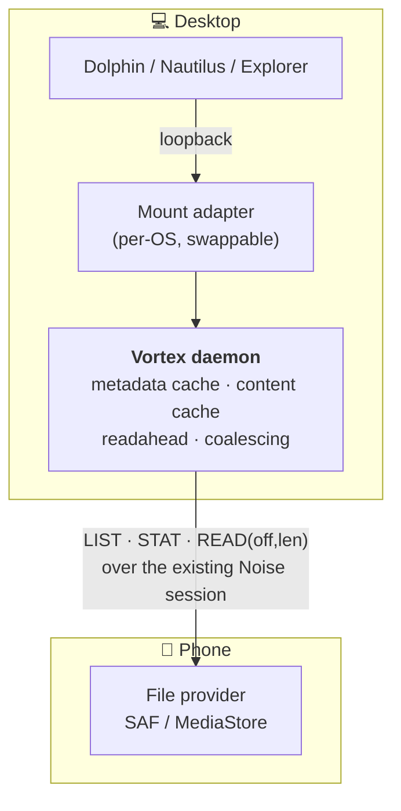

# Browsing the phone's files from the desktop

**Status:** built through §8 step 2, plus step 6 (the mounts) on both OSes.
Steps 3-5 — the daemon cache layer, a WebDAV gateway, writes — are open; the
gateway is now unlikely, see §4. **Targets:** Linux *and* Windows from day one.
Linux is verified on a device; the Windows adapter compiles and has never run
(§8 step 6).

Goal: open the phone's storage in Dolphin / Nautilus / Explorer, like KDE
Connect does. Read-only first, writes stubbed.

---

## 1. Why this is the same work as fixing large-file transfer

There is exactly one missing primitive underneath both features:

```
READ(handle, offset, len) -> bytes
```

- **Browsing** needs it because file managers issue ranged reads constantly —
  Explorer's redirector does, thumbnailers do, media players seek.
- **Large-file transfer** needs it because the current design buffers whole
  files, which is what crashed the app on an 835 MB share (`OutOfMemoryError`,
  876 MB against a 256 MB heap growth limit).

Today there is **no offset-based read anywhere** in the codebase, and the
Android app declares **no storage permissions at all** — file access is only
ever a `content://` URI handed over by the share sheet. So both features start
from the same standing start, and the 64 MB `MAX_FILE_BYTES` cap disappears as a
side effect of building the primitive rather than as a separate change.

**Corollary:** do not raise `MAX_FILE_BYTES` in the meantime. It is bounded by
the process heap, so a bigger constant only moves the crash.

---

## 2. Layering

The load-bearing decision: **the phone serves a dumb, narrow protocol; the
laptop does everything clever.**



Three consequences worth stating explicitly:

**All caching lives in the daemon.** The Android app answers ranged reads and
nothing more — no cache, no prefetch, no invalidation logic. Android is the
worst place for that code: process death, Doze, and low-memory kills make cache
lifetime unpredictable, and every cache bug would need a phone rebuild to test.

**The phone never serves the LAN.** The daemon exposes the mount on
**loopback only** and proxies over the already-authenticated Noise session. This
reuses pairing as the auth model — no second credential system, no TLS on the
phone, no listening socket exposed to the network, and free choice of port.

**The mount adapter is swappable; the protocol is the investment.** Changing
how the desktop presents the files must never require touching the phone.

---

## 3. The protocol

New frame types, additive (unknown types are logged and ignored on both sides,
so no version gate is needed). Rides the existing sealed app-data channel.

| Op | Direction | Payload | v1 |
|---|---|---|---|
| `FS_LIST` | laptop → phone | path / tree handle, cursor | ✅ |
| `FS_STAT` | laptop → phone | path | ✅ |
| `FS_READ` | laptop → phone | handle, offset, len | ✅ |
| `FS_WRITE` | laptop → phone | handle, offset, bytes | **stub** |
| `FS_SETMETA` | laptop → phone | path, mtime / mode / rename | **stub** |
| `FS_DATA` | phone → laptop | request id, offset, bytes, eof | ✅ |
| `FS_META` | phone → laptop | entries / stat result | ✅ |
| `FS_ERR` | phone → laptop | request id, code | ✅ |

Stub means: **defined, wired, and answered with a clear `FS_ERR` "not
supported"** — not silently dropped. A stub that looks like a timeout is worse
than an honest refusal, and the file manager needs a definite answer to avoid
hanging.

Design notes:

- **Request IDs, not a request/response lock.** File managers issue many
  concurrent stats; a strictly serialised protocol would feel broken. Cap
  in-flight requests (the phone's link is not infinitely parallel) and pipeline
  the rest.
- **Reads are bounded per frame.** Existing `MAX_FRAME_PAYLOAD` is 63 KiB; the
  daemon issues many ranged reads rather than one huge one. That is what keeps
  memory flat on both sides.
- **Directory listings paginate.** A 10,000-entry folder must not be one frame.
- **Handles, not paths, for reads.** A path resolved per read is a TOCTOU
  problem and slow under SAF; open once, read many, close.

---

## 4. Desktop presentation: native VFS on both, WebDAV never built

***Both* operating systems went straight to the native VFS (v2); WebDAV was
skipped entirely.** Its whole argument was being the cheapest path to something
usable, and on neither OS did that survive contact:

* **Linux** — GVFS and KIO mount `davs://` *inside the file manager's own
  process*, so only that program's file dialogs would see the files. `cp`,
  `mpv`, `ffprobe`, a text editor's Open box: none of them. FUSE is a real path
  in the filesystem, so everything sees it.
* **Windows** — the WebClient redirector caps a file at ~50 MB by default, and
  escaping a 64 MB cap into a 50 MB one would have been absurd. ProjFS has no
  such ceiling and needs no third-party install.

What v1 was really buying was *one* implementation instead of two. That turned
out to be the wrong unit of accounting: the two native adapters share
everything above the OS call (`fs_vfs.rs` — caching, the path walk, pipelined
reads, the concurrency cap) and differ only in the translation layer, which a
WebDAV gateway would have needed anyway in the form of an HTTP server. Two
adapters over one shared core came to about the same code as one gateway, with
no size limits, no port, no auth story and no second process.

The v1 sketch is kept below because its Windows caveat table is the reason
ProjFS won there, and because it is the road not taken.

### v1 — WebDAV on loopback (not built)

One implementation serving both OSes:

- **Linux:** `davs://localhost:PORT` via GVFS (Nautilus) / KIO (Dolphin).
- **Windows:** `\\localhost@PORT\DavWWWRoot\` via the WebClient redirector.

Cheapest path to something usable, and platform-neutral Rust in the daemon.

**Windows WebDAV caveats — plan for these, they are not hypothetical:**

| Issue | Detail |
|---|---|
| `FileSizeLimitInBytes` | WebClient defaults to ~**50 MB**. Escaping a 64 MB cap into a 50 MB one would be absurd — needs a registry change or an installer step |
| Basic auth over HTTP | Disabled by default (`BasicAuthLevel`). Avoidable by requiring **no auth on loopback** — nothing but local processes can reach it |
| WebClient service | Must be running; Explorer's WebDAV client is slow and flaky under load |
| Port syntax | Non-standard ports need the `\\host@port\` form, which is unfamiliar to users |

Loopback-only binding removes the auth problem outright. The 50 MB limit does
not go away and is the main reason v1 may not be the end state.

### v2 — native virtual filesystem — **both done**

- **Linux:** FUSE ([`fs_fuse.rs`]), mounted at `$XDG_RUNTIME_DIR/vortex/phone`.
- **Windows:** **ProjFS** ([`fs_projfs.rs`]), projected at
  `%LOCALAPPDATA%\Vortex\phone`. Ships in Windows 10 1809+ with no
  third-party install — it is what VFS for Git uses — though it is an optional
  feature that is off by default on client SKUs, so the mount error says how to
  turn it on.

Three files, not two: [`fs_vfs.rs`] is everything between an adapter and the
wire — the caches, the path walk, the pipelined ranged reads, the concurrency
cap — and the adapters are only translation. That is what keeps "the mount
adapter is swappable; the protocol is the investment" true in the code and not
just in this document: adding Windows touched nothing the phone can observe.

**The threading models are opposites, and that is the whole difference.**

| | FUSE | ProjFS |
|---|---|---|
| Request delivery | one at a time, one session thread | its own thread pool, concurrent |
| So the adapter must | **never block** — hand every op to the async runtime and answer from there | **block freely** — that is what the pool is for |
| Concurrency limited by | our semaphore | our semaphore (the pool is sized above it on purpose) |

Blocking a FUSE session thread serialises the entire mount behind one round
trip at a time. Blocking a ProjFS pool thread is what ProjFS is built for — so
the Windows callbacks are plainly synchronous, and the pool is sized at twice
`MAX_INFLIGHT` so the shared semaphore runs out first and a thundering
thumbnailer cannot exhaust the pool and wedge Explorer. If that ever stops
holding, ProjFS has its own escape hatch (`ERROR_IO_PENDING` plus
`PrjCompleteCommand`); it costs an owned copy of every callback parameter,
which is why it is not the starting point.

**Read-only is enforced differently too.** FUSE takes an `ro` mount option and
the kernel refuses writes before they reach us. ProjFS has no such flag, so the
projection marks every placeholder `FILE_ATTRIBUTE_READONLY` (advisory — it
greys the commands out in Explorer) *and* vetoes `PRE_DELETE`, `PRE_RENAME`,
`PRE_SET_HARDLINK` and `FILE_PRE_CONVERT_TO_FULL` from the notification
callback, which is the half that actually enforces it.

**One thing ProjFS gives free and one it costs.** It hydrates fetched content
into the real directory and serves later reads from disk without asking us —
design doc §7's content cache, for nothing. The cost is staleness: a file that
changes on the phone is not re-fetched. The projection is therefore cleared at
each mount, so a session starts from the phone's current truth; *within* a
session a changed file still shows its old content. Fixing that properly means
deriving a placeholder ContentID from size and mtime and driving
`PrjUpdateFileIfNeeded` — the natural companion to step 3.

### Rejected: SFTP + sshfs

What KDE Connect uses, and excellent on Linux. On Windows it needs WinFsp +
SSHFS-Win — a third-party install we would be asking every user to do. Out on
the cross-platform requirement alone.

### Rejected: SMB

Explorer's best-supported protocol, but the Windows client effectively requires
port 445, which Android cannot bind (privileged port, no root), and Android SMB
server implementations are heavy. Non-starter.

---

## 5. Android file access — a decision to make

There is no storage permission today, so this is new surface either way:

| Option | Gets you | Costs |
|---|---|---|
| **SAF trees** (`ACTION_OPEN_DOCUMENT_TREE`) | user grants specific folders | content URIs rather than paths, slower enumeration, no whole-device view |
| **`MANAGE_EXTERNAL_STORAGE`** | full filesystem, the KDE Connect experience | alarming permission dialog; Play-Store-restricted (not binding — Vortex ships via GitHub releases) |

**Recommendation:** SAF trees as the default, all-files access as an explicit
opt-in for users who want the full view. That keeps the scary permission out of
the first-run path while not capping what power users can do.

*Implemented as recommended.* "Shared folders" runs the SAF picker; "Allow
access to any files" opens Android's special-access screen and is never touched
on the first-run path. Neither grant is mirrored into a preference of ours — the
OS grant IS the setting, read live, so a revocation in system settings cannot
leave us offering a root we can no longer read.

Two consequences worth knowing:

* All-files **supersedes** the picked folders rather than adding to them.
  Serving both would show one file under two unrelated paths, and nothing on
  the wire says they are the same file.
* Under all-files the served root is shared storage only, still canonicalised
  and gated. Being granted all-files is not agreement to serve `/data`: the
  user turned on "any files" meaning *their* files, and the app can read a
  great deal more than that.

---

## 6. Transport reality

**Content streams over Wi-Fi.** BLE is tens of KB/s — unusable for file bytes,
and the moment a file is more than trivial the user will turn Wi-Fi on anyway.

BLE stays useful for **metadata and wake-up**: a directory listing or a stat can
ride it, and it is how the daemon knows the phone is there at all. So:

- Wi-Fi (LAN, or Wi-Fi Direct for bulk) is required for content.
- With no usable network, the mount reports an honest, immediate error rather
  than hanging — a file manager blocked on a dead read is the worst outcome.
  *Done:* a request that reaches neither transport fails at once with
  `EHOSTDOWN` — or `ERROR_HOST_DOWN`, which Explorer renders as "The host is
  down" — instead of waiting out the 20 s reply timeout. Twenty seconds per
  operation on a phone that is simply not here is indistinguishable from a hung
  file manager. Both adapters map the protocol's codes straight across, which
  is what the errno shape in §3 was for.
- Wi-Fi Direct is already used for large transfers and applies here unchanged.

---

## 7. What makes this feel fast or broken

This is where these features usually fail, and it is all daemon-side:

- **Metadata cache with invalidation.** File managers stat everything in view,
  repeatedly. Without a cache, every icon refresh is a round trip. *Done for
  the mount, mostly by the kernel:* attributes and directory entries carry a
  5 s TTL, so a repeat `stat` inside that window never even reaches our
  process. The other half is ours — a listing seeds the attribute cache for
  every entry in it, which is what makes the `lookup` + `getattr` storm that
  follows a `readdir` cost nothing. Invalidation is the TTL expiring; there is
  no push notification of a change on the phone, and 5 s is the compromise.
- **Readahead.** Sequential reads (copying, media playback) should pull ahead of
  the requested range; a strict 63 KiB request/response ping-pong will never
  saturate Wi-Fi. *Partly done:* both clients keep 4 ranged reads in flight,
  which turns the round trip from a per-chunk cost into an overlapped one —
  2.07 to 8.1 MB/s laptop-side, 0.4 to 2.3 MB/s phone-side. Reading *ahead* of
  what was asked for arrives with the mount, and again from the kernel rather
  than from us: a sequential reader makes the kernel issue several `read` calls
  at once, and because the mount answers every one off-thread instead of
  blocking, they overlap on the wire. A daemon-side readahead of its own is
  still open, and is what would help the *first* read of a file.
- **Coalescing and a concurrency cap.** Thumbnailers fire dozens of parallel
  reads; unbounded, they will starve the link and the BLE session with it. *Cap
  done:* the mount holds a semaphore of 8 over every request it sends, so a
  folder of photos cannot queue megabytes of image data ahead of the next
  listing. Coalescing overlapping ranges is not done.
- **Content cache with a byte budget**, not an entry count — one 2 GB video must
  not evict a whole tree's metadata.
- **Honest errors.** Every failure path returns a definite error quickly.
  Hanging is worse than failing.

---

## 8. Sequencing

1. **`FS_STAT` + `FS_LIST` + `FS_READ`** on the phone (answer ranged reads,
   nothing else) and the daemon-side client. No mount yet — validate over the
   existing session with a CLI. **Done and validated on a device**
   (2026-09-06, over BLE, all-files root): `--fs-ls` returned 34 entries of
   shared storage; `--fs-stat` matched size and mtime; `--fs-get` fetched
   28 KB and 482 KB files byte-identical by md5, the latter over 11 ranged
   reads with the zip still passing `unzip -t`. Refusals behave: a missing path
   inside a root answers NOENT, while `/data/...`, `/etc/hosts` and a SAF URI
   under all-files all answer ACCES, so a peer cannot probe outside what is
   served.

   Two bugs it caught, both pre-existing and neither specific to this feature:
   fragments were sized at `MTU-3` while GATT caps an attribute value at 512
   and *throws* above it, so fragmenting crashed the app on a 517-MTU link; and
   `init_logging` rolled the log on every forwarding CLI launch, destroying the
   running app's file.

   Wi-Fi is now the preferred transport, with BLE as the fallback (§6). Same
   482 KB file, same phone, same session: **41 KiB/s over BLE, 931 KiB/s over
   LAN** — 23x — and a directory listing went from ~2.5 s to 11 ms. Both
   byte-identical. The gain is mostly framing: a BLE notify caps at 512 bytes,
   so a 48 KiB read is ~96 fragments paced 10 ms apart, against one TCP frame.

   The LAN session is opened lazily, kept for 60 s of idleness, and both
   transports serve from ONE handle table on the phone — a handle minted by
   OPEN over Wi-Fi must still be readable by a READ that fell back to BLE.
2. **Rework large-file transfer onto ranged reads.** Removes `MAX_FILE_BYTES`
   and the buffer-the-whole-file crash. Ships value before any mount exists.
   **Done.** A share now registers a *grant* (a URI plus a random token) instead
   of reading the file, and the laptop pulls it through `FS_OPEN`/`FS_READ`/
   `FS_CLOSE` straight to disk. `MAX_FILE_BYTES` is deleted on both sides.
   Verified on the device with a 151 MB APK — 2.4x the old cap, so previously
   refused outright: byte-identical in 73 s, and the phone's Java heap stayed at
   16-23 MB throughout, where the old path would have had to hold all 151 MB.

   A share-sheet file is authorised differently from a browsed one, so it gets
   its own gate ([`ShareGrants`]): the act of sharing IS the authorisation,
   scoped to that one file, addressed by an unguessable token, revoked when the
   laptop closes it. It is not, and cannot become, a root.
3. **Daemon cache layer** — metadata, readahead, content budget.
4. **WebDAV loopback gateway**, both OSes.
5. **`FS_WRITE` / `FS_SETMETA`** for real, once read-only is solid.
6. **FUSE + ProjFS**, if the Windows WebDAV limits bite. **Both done**, ahead
   of steps 3-5 and instead of WebDAV on either OS — see §4. `--fs-mount` /
   `--fs-umount`, or the folder button on the phone's card, put the phone's
   storage at `$XDG_RUNTIME_DIR/vortex/phone` (Linux) or
   `%LOCALAPPDATA%\Vortex\phone` (Windows), read-only, and every program on
   the machine can read it.

   The load-bearing decision on Linux is that **nothing blocks the FUSE session
   thread**: each operation is handed to the async runtime and its reply object
   (which fuser makes `Send` for exactly this) is answered when the phone
   answers. Serving inline instead would cost one full round trip per operation
   in series, and a file manager opening a folder issues dozens at once. On
   Windows the same requirement is met by doing the opposite — see §4's table.

   What is not there yet: writes (step 5 — the mount is `ro`, so the kernel
   refuses them without a round trip), a content cache, coalescing, and
   `statfs` numbers (there is no protocol op for free space, and inventing one
   for a read-only mount would be a lie a file manager acts on).

   Verified against a real kernel mount over a fake peer — `read_dir`, a
   100 KiB file read back byte-identical through the page cache, a `stat`, and
   a write refused. That test needs `/dev/fuse`, so it is `#[ignore]`d and run
   with `cargo test --lib fs_mount -- --ignored`.

   Reachable from the UI: a folder button on the right of the phone card's
   "Connected" row mounts on demand and hands the path to the platform's file
   manager (`xdg-open`, or `explorer.exe`). Mounting is what can
   fail — the phone may have gone since the card last said Connected — so the
   button holds the error for a few seconds with the reason in its tooltip,
   rather than opening a file manager onto nothing.

   **Verified on the device** (2026-09-07, over Wi-Fi, all-files root). The
   phone's shared storage appeared at `/run/user/1000/vortex/phone` as
   `fuse.vortex (ro,nosuid,nodev,noexec,default_permissions)` with real names
   and mtimes; a cold listing took ~300 ms and a subdirectory 12 ms.

   * A 52 MB 4K video: `md5sum` matched the phone's in 7.4 s (7.1 MB/s), and
     `ffprobe` read its codec, resolution and duration — a real seeking
     consumer, not just a sequential one.
   * A 481 MB APK: `cat | md5sum` matched in 66 s (7.3 MB/s) while the phone's
     Java heap went 30.7 MB → 17.6 MB (a GC ran) and its native heap sat at
     12.1 MB. Nothing is buffered, at 7.5x the size of the cap this feature
     started out working around.
   * A 3.4 GB ROM zip listed with its true size, and the last 64 KiB read at
     offset 3,396,354,250 matched the phone's md5 of the same range — past
     2^31, so the 64-bit offsets survive the whole stack.
   * `touch` in the mount: "Read-only file system", refused by the kernel
     without a round trip.

   **The Windows half has never run.** There is no Windows machine in this
   project's loop, so ProjFS is verified only as far as a cross-compile reaches.
   A whole binary does cross-build from Linux, which is further than a check:

   ```text
   cd linux/ui-tauri && npm run build          # the embedded frontend
   cd src-tauri && cargo build --release \
       --target x86_64-pc-windows-gnu \
       --features custom-protocol --bin vortex-ui-tauri
   ```

   needing only mingw-w64 (`-gnu`, not `-msvc`: an MSVC cross-link wants
   `lib.exe`). The result imports all eleven `Prj*` entry points from
   `projectedfslib.dll`, which is the strongest check available here that the
   FFI is wired correctly rather than merely type-correct. Ship
   `WebView2Loader.dll` beside it — it is a dynamic import, and the app will
   not start without it.

   `cargo check --all-targets --target x86_64-pc-windows-gnu` is clean, which
   type-checks every callback signature, struct layout and constant against the
   real Win32 metadata — and nothing about behaviour. What that cannot catch is
   the ProjFS *protocol*: enumeration restart and buffer-full handling, the
   write-alignment rule, whether the notification veto covers every path to a
   write. Those are written from the documented contract with the reasoning in
   comments, and they are what a first run on Windows should be expected to
   shake out. The shared layer under it (`fs_vfs.rs`) is tested on every
   platform, which is deliberately where the path walk lives — it is the
   hardest part of the Windows adapter and the part least able to be tested
   there.

   Two things that only a live run surfaced. Every path walk was asking us
   `access` and every `close` a `flush`, and `getxattr`/`listxattr` on top —
   fuser logs each as "[Not Implemented]", so an ordinary `ls` wrote warnings
   into the app's log and paid a session round trip to answer "yes". Answering
   them locally (and handing permission checks to the kernel with
   `default_permissions`, which is what stops `access` being sent at all) took
   that to zero and the 52 MB read from 8.6 s to 7.4 s. And the stale-mount
   recovery was in the wrong order: a mount whose server was SIGKILLed (a
   crash, or the installer restarting the app) stays in the table answering
   `ENOTCONN`, which includes the `stat` inside `create_dir_all` — so
   *creating* the mount point failed with EEXIST before the code that clears
   the corpse ever ran.

Steps 1–2 are worth doing regardless of whether the mount ever ships, which is
the main argument for this ordering.

## 8b. Browsing the laptop from the phone

The protocol is symmetric, so this needed no new frames: the phone sends the
same ops it answers. `FsClient` is the consumer half (pipelined, id-correlated,
20 s timeout), `LaptopFilesScreen` browses and downloads to `Downloads/`, and
the laptop's roots config decides what is visible.

**Verified on the device** (2026-09-06): listed the laptop's home directory,
descended two levels, and downloaded both a 1 KB file (one read) and a 299 KB
file (multiple ranged reads) — both byte-identical by md5.

**The opening request rides BLE; everything after it rides Wi-Fi.** The phone
cannot dial the laptop — the laptop runs no listener — so it cannot open a LAN
session itself. What it can do is answer on the session the LAPTOP opens to
deliver its reply: that socket is bidirectional, and the laptop's dispatcher
serves an `FS_REQ` arriving on it whichever side sent it. So the first request
of a browse goes over BLE, the laptop's reply brings the session up, and the
phone sends everything after it there — including every ranged read of a
download. Measured: 18.4 MB in 8 s (~2.3 MB/s) against ~40 KiB/s on BLE.

The phone binds its sender to the connection that has actually carried an FS
frame, not the newest one, because the laptop also opens short-lived heartbeat
sessions and a request sent down one of those would die with it.

**A note on what remains BLE-only.** The laptop prefers Wi-Fi for the same traffic in the
other direction, and it can because the PHONE listens on TCP and the laptop
dials it. There is no listener the other way, so a phone-initiated LAN session
has nothing to connect to. Listings are small and fine over BLE; pulling a large
file this way runs at ~40 KiB/s. Closing that gap means giving the laptop a
listener — worth doing, and the natural companion to step 3.

## 9. Open questions

- **ProjFS is imported at load time, and that is wrong for shipping.** The
  eleven `Prj*` calls are ordinary static imports, so if `projectedfslib.dll`
  is absent — possible on a machine where the optional feature has never been
  enabled — Windows refuses to start the *whole app*, with a missing-DLL error
  rather than the mount politely declining. A user who never wanted to browse
  their phone's files would lose notifications, clipboard and calls with it.
  The fix is to reach ProjFS through `LoadLibrary`/`GetProcAddress` instead,
  which costs the compiler-checked signatures the `windows` crate currently
  gives us — a bad trade while nothing has run, a necessary one before release.
  (Delay-loading is not the answer on its own: a delay-load failure raises a
  structured exception, so it needs a failure hook to become an error.)
- ~~**Windows `FileSizeLimitInBytes`:** ship a registry tweak in the installer,
  document it, or skip straight to ProjFS?~~ **Answered: straight to ProjFS**,
  so the limit never applies. What replaces it as a Windows deployment question
  is that ProjFS is an optional feature, off by default on client SKUs — the
  mount error says how to enable it, and an installer step could do it instead.
- **Handle lifetime** across phone process death — the daemon must transparently
  reopen, or the file manager will see spurious I/O errors after a Doze kill.
- **Multi-peer:** with several paired phones, is the mount per-phone (a mount
  point each) or does it follow the active peer? Per-phone is more predictable
  but multiplies mounts. *Answered by construction for now:* the protocol
  client takes no peer — it sends to whichever session is up — so the single
  mount follows the active peer. A per-phone mount is not expressible until the
  client is addressed by peer, which is the real prerequisite here.
- **Thumbnails:** let the desktop generate them by reading bytes (simple, heavy
  on the link), or ask the phone for MediaStore thumbnails (fast, needs another
  op)?
